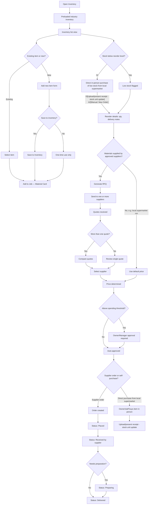

```mermaid
flowchart TD
    A[Open Inventory] --> B[Preloaded industry inventory]
    B --> C[Inventory list view]
    C --> D{Existing item or new?}
    D -->|Existing| E[Select item]
    D -->|New| F[Add new item form]
    F --> F2{Save to inventory?}
    F2 -->|Yes| H[Save to Inventory]
    F2 -->|No| H2[One-time use only]
    E --> G[Add to Job — Material Card]
    H --> G
    H2 --> G

    C --> I{Stock below reorder level?}
    I -->|Yes| J[Low stock flagged]
    I --> |Or| I2[Direct in-person purchase of low stock from local supermarket]
    I2 -- I3[Upload/present receipt - stock unit update]
    A2[Manual: New Order] --> K
    J --> K[Reorder details: qty, delivery notes]
    K --> K2{Materials supplied by approved suppliers?}

    K2 -->|Yes| L2[Generate RFQ]
    L2 --> L3[Send to one or more suppliers]
    L3 --> L4[Quotes received]
    L4 --> L5{More than one quote?}
    L5 -->|Yes| L6[Compare quotes]
    L5 -->|No| L7[Review single quote]
    L6 --> L8[Select supplier]
    L7 --> L8
    L8 --> PriceSet[Price determined]

    K2 -->|No, e.g. local supermarket run| DefP[Use default price]
    DefP --> PriceSet

    PriceSet --> L9{Above spending threshold?}
    L9 -->|No| L10[Auto-approved]
    L9 -->|Yes| L11[Owner/Manager approval required]
    L11 --> L10

    L10 --> Fork{Supplier order or self-purchase?}
    Fork -->|Supplier order| P[Order created]
    P --> Q[Status: Placed]
    Q --> Q2[Status: Received by supplier]
    Q2 --> R{Needs preparation?}
    R -->|Yes| T[Status: Preparing]
    R -->|No| U[Status: Delivered]
    T --> U

    Fork -->|Direct purchase from local supermarket| SP[Owner/staff buys item in person]
    SP --> SP2[Upload/present receipt - stock unit update]
```
