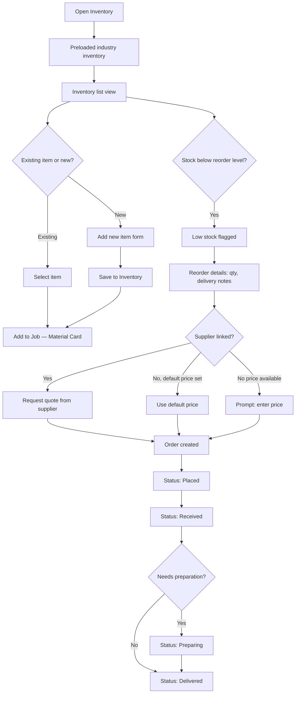

```mermaid
flowchart TD
    A[Open Inventory] --> B[Preloaded industry inventory]
    B --> C[Inventory list view]
    C --> D{Existing item or new?}
    D -->|Existing| E[Select item]
    D -->|New| F[Add new item form]
    E --> G[Add to Job — Material Card]
    F --> H[Save to Inventory]
    H --> G

    C --> I{Stock below reorder level?}
    I -->|Yes| J[Low stock flagged]
    J --> K[Reorder details: qty, delivery notes]
    K --> L{Supplier linked?}
    L -->|Yes| M[Request quote from supplier]
    L -->|No, default price set| N[Use default price]
    L -->|No price available| O[Prompt: enter price]
    M --> P[Order created]
    N --> P
    O --> P

    P --> Q[Status: Placed]
    Q --> R[Status: Received]
    R --> S{Needs preparation?}
    S -->|Yes| T[Status: Preparing]
    S -->|No| U[Status: Delivered]
    T --> U
```
